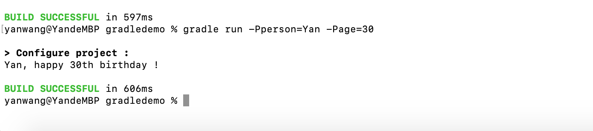

# How to use clourse in gradle project
This demo shows you how to use closure in gradle project


- Define the clourse with two params

  ```
  def greeting={ person, age-> 
  	    println (person+', happy '+age+'th birthday !')
  }
  ```

  

- Define the method to use the defined closure

  ```
  def exec(Closure closure , String person, String age ){
  	closure(person,age)
  }
  ```

- Define the task to call the method from commandline

  ```
  task run(){
  	if (project.hasProperty("person")&project.hasProperty("age")){
  		exec(greeting,  project.getProperty('person') , project.getProperty('age'))
  	}else{
  		exec(greeting, 'Yan' ,'25')
  	}
  }
  ```

  

- Run below command, as you can see, it works! 



